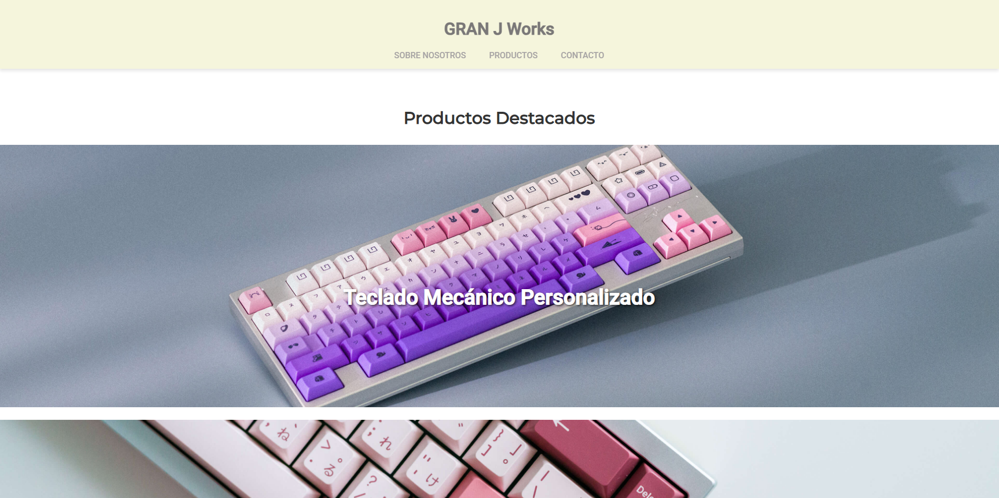
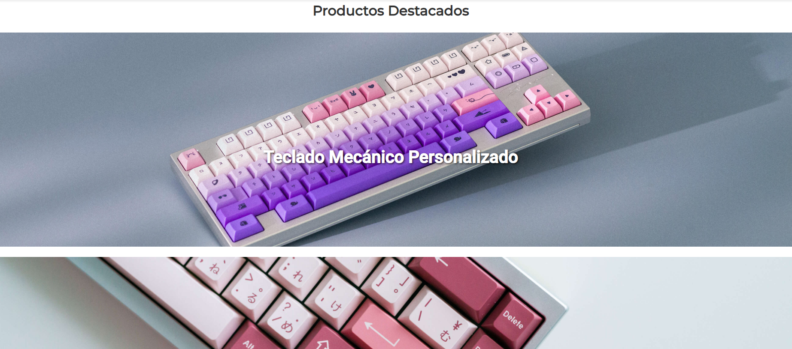

# Proyecto Web - Página prototipo a Rama Works

Este proyecto es una página web que simula el diseño de la tienda en línea llamada Rama Works que se especializa en productos para personas que les gusta los teclados custom y accesorios relacionados al ambito custom en teclados. El objetivo de este proyecto es aplicar los conocimientos adquiridos sobre desarrollo web, incluyendo HTML, CSS, diseño responsivo y mejores prácticas de accesibilidad.

## Características

- //Diseño responsivo//: La página se adapta a diferentes tamaños de pantalla utilizando Flexbox y media queries.
- //Interactividad//: Efectos visuales como el cambio de color en el encabezado al hacer scroll.
- //Servidor básico: Implementado con Node.js y Express para manejar solicitudes y respuestas.
- //API simple: Responde con datos en formato JSON para integrar el front-end con el back-end.
- //Accesibilidad//: Se valida la accesibilidad utilizando herramientas como WAVE.

## Tecnologías utilizadas

- HTML
- CSS (Flexbox, Grid, Media Queries)
- JavaScript (validaciones, eventos y DOM)
- Node.js y Express (para el servidor y la API)

## Interacciones con la API

La API desarrollada con Express expone una ruta (/api/products) que devuelve información sobre los productos destacados en formato JSON. Estos datos se consumen en el front-end mediante el uso de fetch() y se muestran dinámicamente en la sección de "Productos Destacados".
ejemplo de datos de la API:

```bash
[
 { "id": 1, "name": "Teclado Mecánico Personalizado", "price": 120 },
 { "id": 2, "name": "Keycaps Exclusivas", "price": 60 },
 { "id": 3, "name": "Accesorios de Diseño", "price": 35 }
]
```

## Pasos para Ejecutar el Proyecto

1. **Clona el repositorio**  
   Usa el siguiente comando en tu terminal para clonar el repositorio del proyecto:

   ```bash
   git clone https://github.com/GRAN-J/Projecto-web-basic.git
   ```

2. **Instala Node.js**  
    Si no tienes Node.js instalado, descárgalo e instálalo desde su página oficial:
   https://nodejs.org/en

3. **Instala las dependencias**  
   Navega a la carpeta del proyecto clonado y ejecuta los siguientes comandos para instalar las dependencias necesarias:

   - **Inicializa el archivo `package.json`** si no existe, con el siguiente comando:

     ```bash
     npm init -y
     ```

   - **Instala las dependencias necesarias**, incluido Express:
     ```bash
     npm install express
     ```

4. **Inicia el servidor local**
   Ejecuta este comando desde la carpeta del proyecto:

```bash
  node server.js
```

5. **Accede a la aplicación**
   Abre tu navegador y dirígete a:
   http://localhost:3000
6. **Personaliza el contenido**  
   Si deseas realizar cambios en el contenido de la página, puedes editar los archivos `index.html` y `styles.css` con tu editor de texto favorito. Estos archivos permiten modificar la estructura y el estilo de la página web.

   - **index.html**: Aquí puedes modificar la estructura HTML de la página, como el contenido de los encabezados, párrafos, imágenes, etc.
   - **styles.css**: En este archivo puedes cambiar los estilos de la página, como colores, fuentes, márgenes, etc.

   Realiza los cambios que desees para personalizar la página según tus necesidades.

7. **Video explicativo**  
   Si el proceso de instalación no quedó claro, puedes consultar el siguiente video explicativo para una instalación correcta:  
   [Video explicativo de instalación](https://youtu.be/2hP5hmP7jjk)

8. **Capturas**

### Página Principal



### Productos Destacados



### Formulario de Contacto


9. **Despliegue**
   [El proyecto está disponible en la plataforma de netlify.com](https://dapper-choux-625484.netlify.app/)
